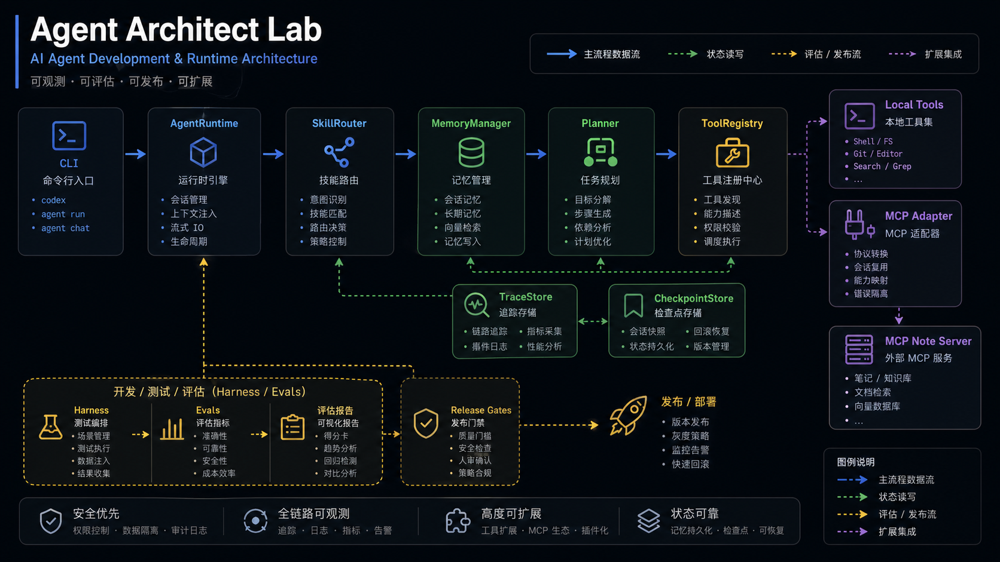

# 代码导览：从一次 CLI 调用读懂 Agent Architect Lab

这份导览适合第一次读代码的人。目标不是把所有文件逐个解释一遍，而是沿着一条真实执行链路看清楚：命令从哪里进来，runtime 如何组织 planner、skill、memory、tool 和 trace，harness 又如何把一次运行变成可评测、可发布的工程资产。



## 先看主入口

从 `src/agent_architect_lab/cli.py` 开始读。这个文件是所有能力的命令行入口，能看到项目的能力边界：

- `run-task`：跑一次 Agent 任务
- `list-skills`：查看 skill 选择
- `run-evals`：跑 harness
- `check-gates` / `evaluate-promotion`：做发布门禁和候选版本比较
- `open-incident` / `transition-incident`：把事故纳入治理闭环
- `run-control-plane-server`：把治理能力暴露成 HTTP control plane

读 CLI 的重点不是记住每个命令，而是看它把参数转交给哪些模块。这个项目的结构基本都能从 CLI 入口反推出去。

## Runtime 执行链路

一次典型任务可以按下面顺序理解：

```text
CLI
  -> AgentRuntime
     -> SkillRouter
     -> MemoryManager
     -> AgentPlanner
     -> ToolRegistry
     -> TraceStore / CheckpointStore
```

阅读顺序建议：

| 顺序 | 文件或目录 | 重点 |
| --- | --- | --- |
| 1 | `src/agent_architect_lab/cli.py` | 命令入口和能力边界 |
| 2 | `src/agent_architect_lab/agent/` | runtime、planner、memory 的组合方式 |
| 3 | `src/agent_architect_lab/tools/` | 本地工具如何注册、校验和调用 |
| 4 | `data/skills/` | skill manifest 如何描述可复用能力 |
| 5 | `data/notes/` | note-backed retrieval 的知识来源 |
| 6 | `src/agent_architect_lab/mcp/` | MCP adapter 如何把外部服务纳入工具层 |

## MCP 怎么读

MCP 相关代码不要一上来陷进协议细节。先看三层：

- server：`scripts/run_mcp_server.py`
- client / protocol：`src/agent_architect_lab/mcp/`
- adapter：把 MCP server 的能力接进 `ToolRegistry`

这里的设计重点是边界感：runtime 不应该知道 MCP server 的内部实现，只需要通过 adapter 使用能力。这个拆法对后续接更多外部工具很关键。

## Harness 怎么读

Harness 部分是这个仓库最有工程味的地方。阅读顺序：

| 顺序 | 文件或目录 | 重点 |
| --- | --- | --- |
| 1 | `src/agent_architect_lab/harness/` | suite、runner、grader、report 的基础结构 |
| 2 | `src/agent_architect_lab/evals/datasets/` | eval task 如何表达 |
| 3 | `docs/HARNESS_PRACTICES.md` | 为什么需要报告对比和 gate |
| 4 | `docs/REPORT_REGISTRY.md` | baseline 如何登记和复用 |
| 5 | `docs/EVALS_AND_SAFEGUARDS_ROADMAP.md` | eval 如何覆盖安全和回归 |

读 harness 时，建议关注三个对象：task、trace、report。task 是输入，trace 是执行过程，report 是可比较的结果。

## Release 和治理链路

这个项目不只关心 Agent 能不能跑，还关心它能不能发布。治理相关可以按下面链路读：

```text
run-evals
  -> report
  -> check-gates
  -> approve-release
  -> deploy-release
  -> incident / rollback / override
  -> operator handoff
```

对应文档：

- `docs/RELEASE_LEDGER_ZH.md`
- `docs/PRODUCTION_RELEASE_SYSTEM_PLAN_ZH.md`
- `docs/CONTROL_PLANE_ZH.md`
- `docs/HUMAN_FEEDBACK_ZH.md`
- `docs/RUNTIME_REALISM_ZH.md`

## 最小读代码练习

建议按这个顺序做一次：

```bash
PYTHONPATH=src python3 -m agent_architect_lab.cli run-task "summarize 'pyproject.toml'"
PYTHONPATH=src python3 -m agent_architect_lab.cli run-evals --suite default
PYTHONPATH=src python3 -m agent_architect_lab.cli check-gates /tmp/agent-architect-lab/.../reports/latest-report.json --suite-aware-defaults
```

跑完之后回到代码里找三件事：

- 任务输入在哪里变成 planner action
- 工具调用在哪里被记录成 trace
- report 如何被 gate 读取

真正理解这三点，就基本读懂了这个仓库的骨架。

